**Document title:** <span style="color:#1E90FF">UmbertoGiacobbiDotBiz</span> YAi CLI Flows and Architecture ✨  
**Prepared by:** Umberto Giacobbi  
**Organization:** <span style="color:#1E90FF">UmbertoGiacobbiDotBiz</span> 🚀  
- **Intended use:** Implementation-grounded architecture and workflow reference for the current YAi CLI runtime.  

## Author Profile

Umberto Giacobbi is a founder, consultant, advisor, developer, and operator with international experience across Italy, Switzerland, the United States, Indonesia, and Vietnam. His work spans projects in Europe, the US, and Southeast Asia, with a focus on practical execution, strategic thinking, and technology-led business building.

## Contact Information

- **Email:** [hello@umbertogiacobbi.biz](mailto:hello@umbertogiacobbi.biz)  
- **LinkedIn:** [linkedin.com/in/umbertogiacobbi](https://www.linkedin.com/in/umbertogiacobbi/)  
- **Website:** [umbertogiacobbi.biz](https://umbertogiacobbi.biz)  

## AI Use and Responsibility Notice

This document may include content generated, refined, or reviewed with the assistance of one or more AI models. It should be reviewed and validated before external distribution or operational use. Final responsibility for its verification, interpretation, and application remains with the author(s) and the organization.

# YAi CLI Flows and Architecture

This document is grounded in the current CLI and runtime code, especially [Program.cs](../../../src/YAi.Client.CLI/Program.cs), [AppPaths.cs](../../../src/YAi.Persona/Services/AppPaths.cs), [ConfigService.cs](../../../src/YAi.Persona/Services/ConfigService.cs), [WorkspaceProfileService.cs](../../../src/YAi.Persona/Services/WorkspaceProfileService.cs), [PromptAssetService.cs](../../../src/YAi.Persona/Services/PromptAssetService.cs), [PromptBuilder.cs](../../../src/YAi.Persona/Services/PromptBuilder.cs), [SkillLoader.cs](../../../src/YAi.Persona/Services/Skills/SkillLoader.cs), [ToolRegistry.cs](../../../src/YAi.Persona/Services/Tools/ToolRegistry.cs), [WorkflowExecutor.cs](../../../src/YAi.Persona/Services/Workflows/Services/WorkflowExecutor.cs), and the RazorConsole screens under [src/YAi.Client.CLI.Components/Screens](../../../src/YAi.Client.CLI.Components/Screens).

## Executive Overview

YAi CLI is a local-first assistant shell that uses OpenRouter-backed chat flows, a bootstrap ritual, workspace-scoped memory, and a RazorConsole UI layer. The process is intentionally command-driven rather than parser-heavy: `Program.cs` reads the raw arguments, handles a small set of special cases early, then wires services and dispatches to the relevant workflow.

The main runtime modes are:
- Help and maintenance commands such as `--help`, `--version`, `--lenna`, `--show-paths`, and `--gonuclear`.
- First-run or explicit bootstrap via `--bootstrap`.
- Chat-style flows via `--ask`, `--translate`, and `--talk`.
- Workspace inspection and memory review via `--knowledge` and `--dream`.
- Default no-args launch, which still performs startup work and then prints help.

Startup is split into a few fixed stages:
- Early argument checks for help, version, and Lenna.
- Global exception handlers.
- Path discovery with `AppPaths`.
- Preflight warnings for OpenRouter key and connectivity.
- Directory creation and logging setup.
- Dependency injection and service resolution.
- OpenRouter balance display, banner splash, model selection, and workspace seeding.
- Command dispatch or bootstrap ritual execution.

Razor screens are now the primary terminal UI layer. Spectre.Console is still used, but mostly as the rendering primitive inside Razor components for markup, panels, status spinners, and console clearing. The chat and bootstrap loops now share a top app header with a clickable `umbertogiacobbi.biz/YAi` link, the workspace location, the current OpenRouter provider and model, and the current local time, plus a bottom status bar that surfaces local or network activity and token counts. The active screen flow is hosted by [RazorScreen.cs](../../../src/YAi.Client.CLI.Components/Screens/RazorScreen.cs), and the current screens include the banner, OpenRouter balance, OpenRouter model selector, configured paths, knowledge hub, exception panel, and destructive reset screen.

Persistent data is split into distinct roots:
- Workspace data under `WorkspaceRoot`.
- Runtime/generated data under `DataRoot`.
- Configuration and cache under `ConfigRoot`.
- Audit files under `WorkspaceRoot/.yai/audit/workflows`.
- Backups under `WorkspaceRoot/.backups`.

Skills, tools, and memory are all loaded explicitly:
- Skills come from bundled and workspace `SKILL.md` files via `SkillLoader`.
- Tools are registered in `ToolRegistry` and injected into prompts and workflow execution.
- Prompt sections come from `PromptAssetService` and are chained from workspace prompt files with a legacy fallback.
- Memory and profile files are read and written through `WorkspaceProfileService`, `HistoryService`, `CandidateStore`, `PromotionService`, and `MemoryTransactionManager`.

Current incomplete or risky areas are visible in code, not speculation:
- `ConfigService.SaveAppConfig()` writes to the bundled `appsettings.json` path in the application base directory, which risks writing into build output or install locations instead of a user overlay.
- `--dreams-review` is mentioned in the dream completion message, but no command dispatch branch wires it up.
- Preflight only warns on missing key or connectivity; later flows can still fail.
- Several loaders prefer fallback or skip behavior instead of hard failure.

## High-Level Architecture

```mermaid
flowchart TD
    User[User / Terminal] --> Program[Program.cs]
    Program --> Preflight[PreflightCheck]
    Program --> Paths[AppPaths]
    Program --> DI[ServiceCollection + AddYAiPersonaServices]
    Program --> Screens[RazorConsole screens]
    Program --> Commands[Command handlers]
    Program --> Logging[Serilog + LLM log repo]

    DI --> Config[ConfigService]
    DI --> PromptAssets[PromptAssetService]
    DI --> Workspace[WorkspaceProfileService]
    DI --> OpenRouter[OpenRouterClient + Catalog + Balance]
    DI --> Skills[SkillLoader + ToolRegistry + WorkflowExecutor]
    DI --> Memory[HistoryService + CandidateStore + PromotionService]

    Screens --> Banner[BannerScreen]
    Screens --> Balance[OpenRouterBalanceScreen]
    Screens --> ModelSelector[OpenRouterModelSelectionScreen]
    Screens --> PathsScreen[ConfiguredPathsScreen]
    Screens --> Knowledge[KnowledgeHubScreen]
    Screens --> Reset[NuclearResetScreen]
    Screens --> Errors[ExceptionScreen]

    Commands --> Ask[--ask]
    Commands --> Translate[--translate]
    Commands --> Talk[--talk / -talk]
    Commands --> KnowledgeCmd[--knowledge]
    Commands --> Dream[--dream]
    Commands --> Bootstrap[--bootstrap]
    Commands --> ShowPaths[--show-paths]
    Commands --> GoNuclear[--gonuclear]
    Commands --> Lenna[--lenna]

    Ask --> PromptBuilder[PromptBuilder + ToolCallParser]
    Translate --> PromptBuilder
    Talk --> PromptBuilder
    Bootstrap --> BootstrapSvc[BootstrapInterviewService]
    Dream --> DreamSvc[DreamingService]
    KnowledgeCmd --> Workspace
    ShowPaths --> Paths
    GoNuclear --> Paths
    Ask --> OpenRouter
    Translate --> OpenRouter
    Talk --> OpenRouter
    BootstrapSvc --> OpenRouter
    DreamSvc --> OpenRouter
```

### Layer Summary

| Layer | Main files/classes | Responsibility | Risk / Notes |
| ----- | ------------------ | -------------- | ------------ |
| Entry and dispatch | [Program.cs](../../../src/YAi.Client.CLI/Program.cs) | Parses the raw command line, handles early exits, wires startup, and dispatches all runtime modes. | Hand-rolled string matching keeps the surface simple, but missing options are easy to forget. |
| Path discovery and validation | [AppPaths.cs](../../../src/YAi.Persona/Services/AppPaths.cs), [PreflightCheck.cs](../../../src/YAi.Client.CLI/Services/PreflightCheck.cs) | Resolves workspace/data/config roots, validates env overrides, creates directories, and probes write access. | Preflight warns instead of failing. `ResolveRoot()` uses a prefix check for install-dir protection. |
| Configuration and prompt assets | [ConfigService.cs](../../../src/YAi.Persona/Services/ConfigService.cs), [PromptAssetService.cs](../../../src/YAi.Persona/Services/PromptAssetService.cs), [PromptBuilder.cs](../../../src/YAi.Persona/Services/PromptBuilder.cs) | Loads bundled config, overlays user config, resolves prompt sections, and builds chat messages. | `SaveAppConfig()` currently targets the bundled `appsettings.json` path; prompt assets still have a legacy fallback. |
| UI rendering | [RazorScreen.cs](../../../src/YAi.Client.CLI.Components/Screens/RazorScreen.cs), [BannerScreen.razor](../../../src/YAi.Client.CLI.Components/Screens/BannerScreen.razor), [OpenRouterBalanceScreen.razor](../../../src/YAi.Client.CLI.Components/Screens/OpenRouterBalanceScreen.razor), [OpenRouterModelSelectionScreen.razor](../../../src/YAi.Client.CLI.Components/Screens/OpenRouterModelSelectionScreen.razor), [ConfiguredPathsScreen.razor](../../../src/YAi.Client.CLI.Components/Screens/ConfiguredPathsScreen.razor), [KnowledgeHubScreen.razor](../../../src/YAi.Client.CLI.Components/Screens/KnowledgeHubScreen.razor), [NuclearResetScreen.razor](../../../src/YAi.Client.CLI.Components/Screens/NuclearResetScreen.razor), [ExceptionScreen.razor](../../../src/YAi.Client.CLI.Components/Screens/ExceptionScreen.razor) | Renders terminal UI through RazorConsole components and returns typed results. | Banner, balance, config paths, and exception screens auto-close; model selection and knowledge hub are interactive. |
| Skills, tools, and workflows | [SkillLoader.cs](../../../src/YAi.Persona/Services/Skills/SkillLoader.cs), [ToolRegistry.cs](../../../src/YAi.Persona/Services/Tools/ToolRegistry.cs), [ToolCallParser.cs](../../../src/YAi.Persona/Services/Tools/ToolCallParser.cs), [WorkflowExecutor.cs](../../../src/YAi.Persona/Services/Workflows/Services/WorkflowExecutor.cs), [WorkflowApprovalService.cs](../../../src/YAi.Persona/Services/Workflows/Services/WorkflowApprovalService.cs), [WorkflowVariableResolver.cs](../../../src/YAi.Persona/Services/Workflows/WorkflowVariableResolver.cs), [MinimalSkillSchemaValidator.cs](../../../src/YAi.Persona/Services/Skills/Validation/MinimalSkillSchemaValidator.cs), [FilesystemTool.cs](../../../src/YAi.Persona/Services/Tools/Filesystem/FilesystemTool.cs), [SystemInfoTool.cs](../../../src/YAi.Persona/Services/Tools/SystemInfo/SystemInfoTool.cs) | Loads skills, registers tools, parses tool calls, resolves variables, validates schemas, requests approval, and executes workflow steps. | `filesystem.plan` is disabled for MVP. Schema validation is intentionally minimal. |
| Memory, history, and dreams | [WorkspaceProfileService.cs](../../../src/YAi.Persona/Services/WorkspaceProfileService.cs), [MemoryFileParser.cs](../../../src/YAi.Persona/Services/MemoryFileParser.cs), [HistoryService.cs](../../../src/YAi.Persona/Services/HistoryService.cs), [DreamingService.cs](../../../src/YAi.Persona/Services/DreamingService.cs), [CandidateStore.cs](../../../src/YAi.Persona/Services/CandidateStore.cs), [PromotionService.cs](../../../src/YAi.Persona/Services/PromotionService.cs), [MemoryTransactionManager.cs](../../../src/YAi.Persona/Services/MemoryTransactionManager.cs) | Seeds workspace templates, reads and writes memory files, stores history, stages dream candidates, and promotes approved memory. | Atomic writes are used for most writes. `MemoryFileParser` only handles simple front matter. |
| OpenRouter integration and diagnostics | [OpenRouterClient.cs](../../../src/YAi.Persona/Services/OpenRouterClient.cs), [OpenRouterCatalogService.cs](../../../src/YAi.Persona/Services/OpenRouterCatalogService.cs), [OpenRouterBalanceService.cs](../../../src/YAi.Persona/Services/OpenRouterBalanceService.cs), [LlmCallLogRepository.cs](../../../src/YAi.Persona/Services/LlmCallLogRepository.cs) | Sends chat requests, caches catalog and balance, and records LLM calls to SQLite. | Catalog refresh falls back to stale cache. Balance lookup is in-memory only. LLM logging failures are swallowed. |
| Diagnostics and error handling | `RegisterGlobalExceptionHandlers()` in [Program.cs](../../../src/YAi.Client.CLI/Program.cs), [ExceptionScreenMarkupBuilder.cs](../../../src/YAi.Client.CLI.Components/Screens/ExceptionScreenMarkupBuilder.cs) | Renders recoverable and unhandled exceptions in a diagnostic Razor screen and logs them. | The app generally favors warning and continuation over hard stop unless a branch is explicitly fatal. |

## Command-Line Options Inventory

| Option / Command | Purpose | Entry point | Main handler | Current status | Notes |
| ---------------- | ------- | ----------- | ------------ | -------------- | ----- |
| No args | Startup, workspace/model setup, then help output | Top-level `Program.cs` flow | Startup branches + `PrintHelp()` | Implemented | On first run it can auto-bootstrap before help is shown. |
| `--help`, `-h` | Print the command reference and exit | `IsHelpRequest()` | `PrintHelp()` | Implemented | Runs before preflight, DI, logging, or screens. |
| `--version` | Print the compiled CLI version and exit | `IsVersionRequest()` | `PrintVersion()` | Implemented | Uses the shared `Directory.Build.props` version so every assembly reports the same build number. |
| `--bootstrap` | Run the first-run bootstrap ritual | Top-level `Program.cs` flow | `DoBootstrapAsync()` | Implemented | If no model is configured, the selector runs first. Returns early after the ritual completes. |
| `--show-paths` | Show resolved path inventory | `IsShowPathsRequest()` | `RunShowPathsAsync()` | Implemented | Uses `ConfiguredPathsScreenHost`; skips the normal startup branch. |
| `--gonuclear` | Optionally back up the workspace, data, and config folder structure, then delete the roots | `IsGoNuclearRequest()` | `RunGoNuclearAsync()` | Implemented | Uses `NuclearResetScreenHost`; the backup archive is written outside the deleted roots under `%LOCALAPPDATA%\YAi\backups\yyyyMMdd\`. |
| `--lenna` | Run the Lenna citation script and exit | `IsLennaRequest()` | `RunLennaAsync()` | Implemented | Tries `pwsh` first, then `powershell`. |
| `--ask <text>` | Single-shot chat prompt | Main dispatch branch | `DoAskAsync()` | Implemented | Requires a completed bootstrap and `YAI_OPENROUTER_API_KEY`. Tool calls are allowed through `ToolRegistry`. |
| `--translate <text>` | Translation / rewrite prompt | Main dispatch branch | `DoTranslateAsync()` | Implemented | Requires a completed bootstrap and `YAI_OPENROUTER_API_KEY`. No tool context is injected. |
| `--talk` | Interactive REPL | Main dispatch branch | `DoTalkAsync()` | Implemented | Alias `-talk` is also supported. Requires a completed bootstrap and `YAI_OPENROUTER_API_KEY`. |
| `-talk` | Alias for `--talk` | Main dispatch branch | `DoTalkAsync()` | Implemented | Not surfaced in the README help text, but accepted by `Program.cs`. |
| `--knowledge` | Open the knowledge hub | Main dispatch branch | `new KnowledgeHubScreenHost(appPaths).RunAsync()` | Implemented | Not listed in the README help text. |
| `--dream` | Run the reflection / proposal pass | Main dispatch branch | `DoDreamAsync()` | Implemented | Not listed in the README help text. It writes to `candidates.jsonl` and regenerates `DREAMS.md`. |

## Implemented but Undocumented Options

| Option | Code location | Suggested documentation |
| ------ | ------------- | ----------------------- |
| `--knowledge` | `Program.cs` main dispatch branch | Add it to CLI help and the CLI README because it opens the interactive memory browser. |
| `--dream` | `Program.cs` main dispatch branch | Add it to CLI help and the CLI README because it runs the dreaming reflection pass. |
| `-talk` | `Program.cs` main dispatch branch | Mention it as an alias in help so users do not have to discover it from code. |

## Mentioned But Not Implemented Options

| Option | Where mentioned | Missing implementation |
| ------ | --------------- | ---------------------- |
| `--dreams-review` | The success message in `DoDreamAsync()` | There is no command dispatch branch or host wiring for the review screen, even though [DreamsReviewScreen.razor](../../../src/YAi.Client.CLI.Components/Screens/DreamsReviewScreen.razor) exists in source. |

## Sequence Diagrams for CLI Workflows

### 4.1 Default startup / no arguments

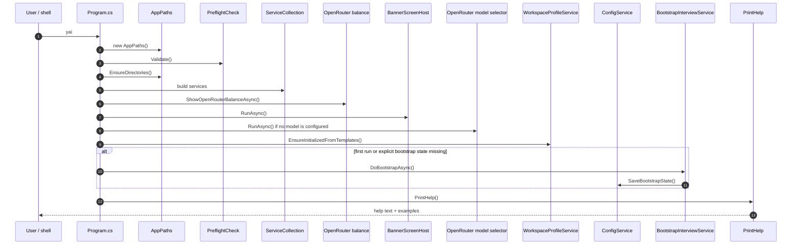

This is the actual default flow today: startup work still happens even when the user passes no arguments, and first run can bootstrap before help is printed.

### 4.2 Help command

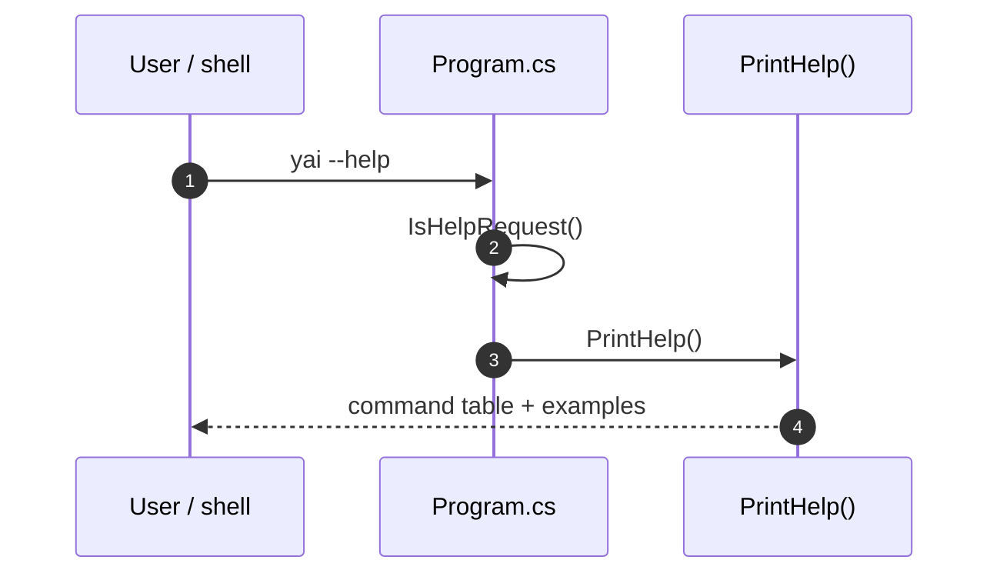

`--help` and `-h` exit before preflight, DI, logging, model selection, or workspace seeding. `--version` follows the same early-exit path and prints the compiled version from `Directory.Build.props`.

### 4.3 Bootstrap command

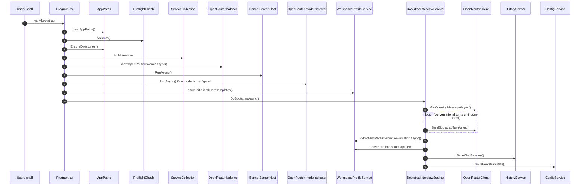

The bootstrap ritual writes the durable profile files, persists `first-run.json`, and marks the runtime bootstrapped. If the OpenRouter key or selected model is missing, the OpenRouter client throws and the exception screen renders the failure.

### 4.4 Workspace initialization and discovery

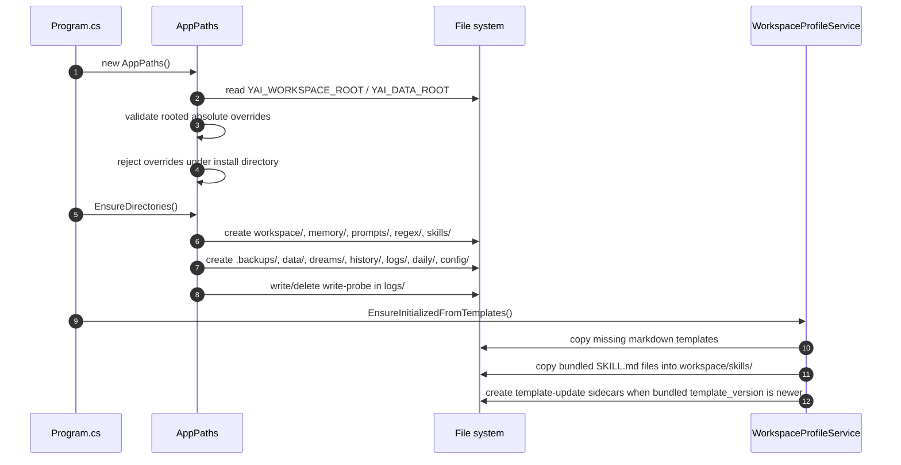

The workspace is created if missing. The runtime workspace is user-owned, while the data root and config root live under local application data by default.

### 4.5 Memory load / read / write flow

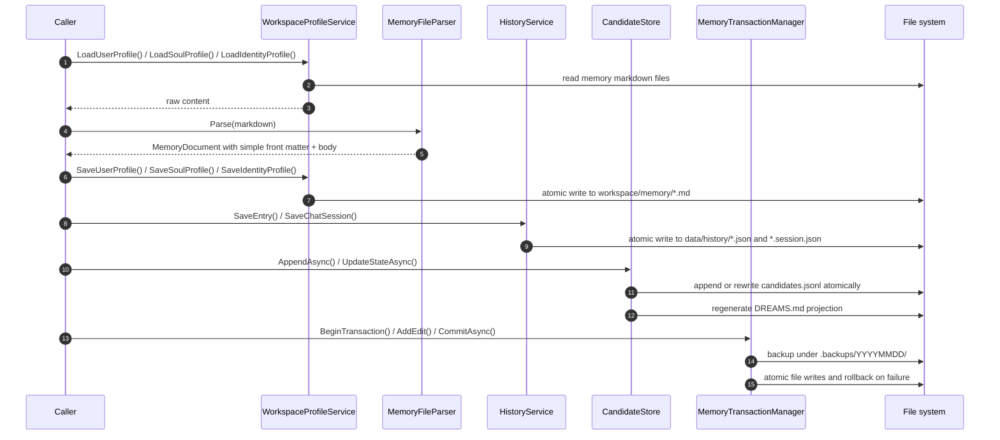

Invalid JSONL lines in `candidates.jsonl` are skipped with warnings. The front-matter parser is simple and only understands scalar `key: value` pairs, not full YAML.

### 4.6 Razor screen rendering flow

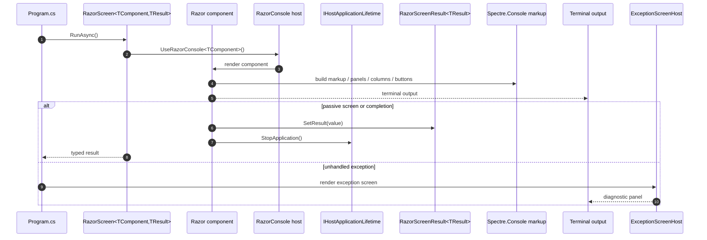

Spectre.Console is still used, but it is no longer the screen architecture itself. The screen architecture is RazorConsole plus typed hosts, and Spectre.Console supplies the markup language and console primitives inside the components.

### 4.7 Skill loading flow

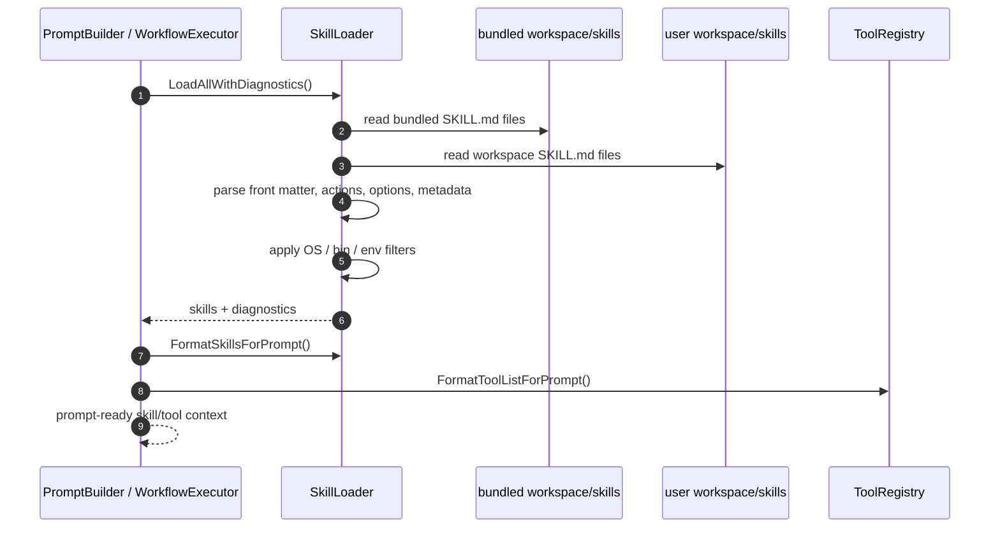

Workspace skills override bundled skills of the same name. Malformed or incomplete skill files are generally dropped rather than crashing the CLI, which is useful for resilience but can hide broken content if diagnostics are ignored.

### 4.8 Tool / action execution flow

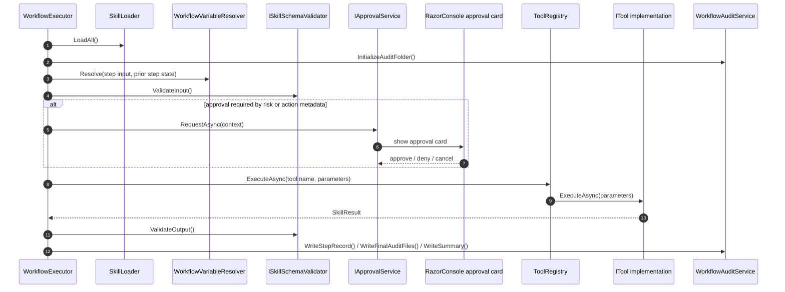

The workflow executor is the stricter execution path. It validates input and output schemas, requests approval before side effects, and writes audit files step by step. The chat tool-call path in `--ask` and `--talk` is lighter-weight and relies on tool-level gates, especially the explicit `approved=true` check inside `filesystem.create_file`.

### 4.9 Error handling and fail-fast flow

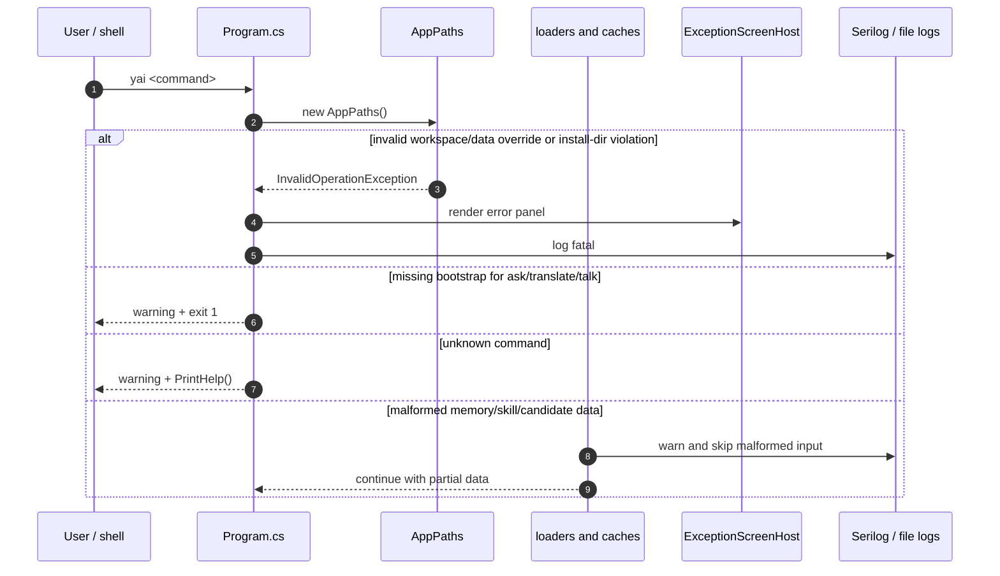

The codebase mixes fail-fast and recoverable behavior intentionally. Some errors stop the launch, some are rendered as warnings, and some malformed inputs are skipped so a single bad file does not break the whole CLI.

## Additional Diagrams Worth Creating

### Configuration loading

```mermaid
flowchart TD
    Env[Environment variables] --> Paths[AppPaths]
    Env --> Key[YAI_OPENROUTER_API_KEY]
    AssetConfig[Bundled appsettings.json] --> Config[ConfigService.LoadConfig()]
    UserOverlay[ConfigRoot/appconfig.json] --> Config
    Config --> AppConfig[AppConfig]
    AppConfig --> OpenRouter[OpenRouterClient]
    AppConfig --> PromptBuilder[PromptBuilder]
    PromptRoot[WorkspaceRoot/prompts/] --> PromptAssets[PromptAssetService]
    LegacyAsset[AssetWorkspaceRoot/SYSTEM-PROMPTS.md] --> PromptAssets
    PromptAssets --> PromptBuilder
    Paths --> CatalogCache[ConfigRoot/openrouter-model-catalog.json]
    Paths --> FirstRun[ConfigRoot/first-run.json]
```

This shows the real split between bundled defaults, user overlay config, prompt files, environment variables, and cached OpenRouter metadata.

### File persistence model

```mermaid
flowchart TD
    AssetRoot[Asset root / AppContext.BaseDirectory] --> AssetWorkspace[workspace/]
    AssetWorkspace --> Templates[markdown templates]
    AssetWorkspace --> Skills[bundled skills]
    AssetRoot --> AppSettings[appsettings.json]

    WorkspaceRoot[WorkspaceRoot] --> Memory[memory/]
    WorkspaceRoot --> Prompts[prompts/]
    WorkspaceRoot --> Regex[regex/]
    WorkspaceRoot --> RuntimeSkills[skills/]
    WorkspaceRoot --> Backups[.backups/]
    WorkspaceRoot --> Bootstrap[BOOTSTRAP.md]
    WorkspaceRoot --> Audit[.yai/audit/workflows/]

    Memory --> User[USER.md]
    Memory --> Soul[SOUL.md]
    Memory --> Identity[IDENTITY.md]
    Memory --> Memories[MEMORIES.md]
    Memory --> Lessons[LESSONS.md]
    Memory --> Corrections[CORRECTIONS.md]
    Memory --> Errors[ERRORS.md]
    Memory --> Limits[LIMITS.md]
    Memory --> Agents[AGENTS.md]

    DataRoot[DataRoot] --> Dreams[dreams/]
    DataRoot --> History[history/]
    DataRoot --> Daily[daily/]
    DataRoot --> LlmDb[llm-calls.db]
    DataRoot --> Logs[logs/]

    Dreams --> Candidates[candidates.jsonl]
    Dreams --> DreamsMd[DREAMS.md]

    ConfigRoot[ConfigRoot] --> AppConfigPath[appconfig.json]
    ConfigRoot --> CatalogCache[openrouter-model-catalog.json]
    ConfigRoot --> FirstRunPath[first-run.json]
```

The key point is that runtime data is separated from bundled assets, but the current model selection save path still targets the bundled `appsettings.json`, which is why that behavior is risky.

### Approval and risk model

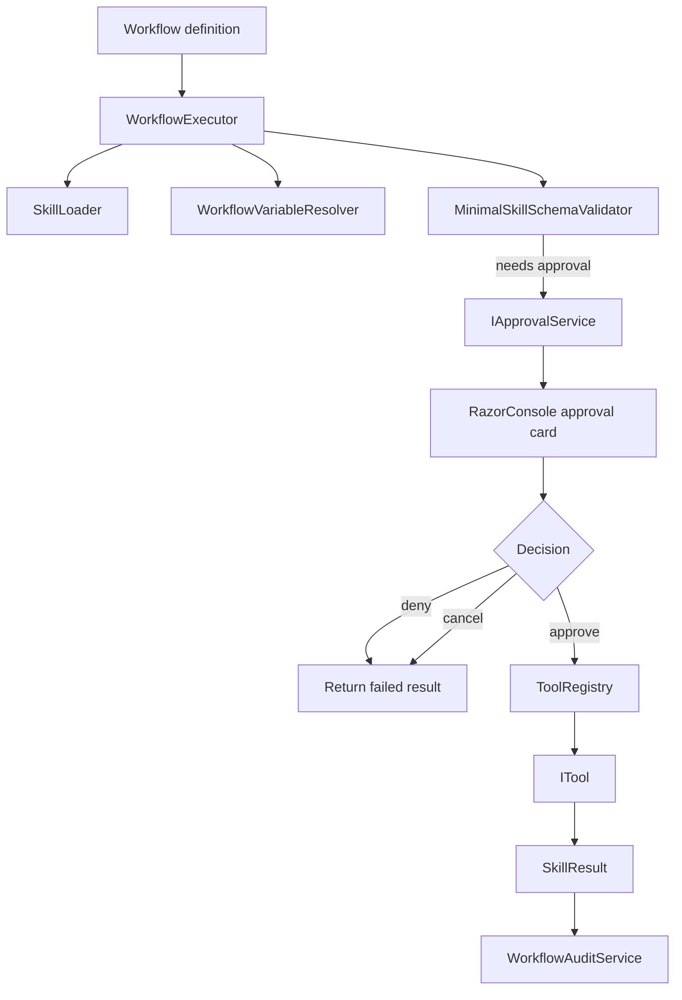

This is the strict path. The chat tool-call path is simpler and does not use `IApprovalService`, so the protection boundary has to live inside the tool itself.

### Dream cycle

```mermaid
flowchart TD
    DreamCmd[--dream] --> DreamSvc[DreamingService.DreamAsync()]
    DreamSvc --> Context[Recent daily files + corrections + lessons]
    Context --> OpenRouter[OpenRouter reflection call]
    OpenRouter --> Candidates[candidates.jsonl]
    Candidates --> DreamsMd[DREAMS.md projection]
    DreamsMd --> Review[DreamsReviewScreen source exists]
    Review --> Gap[No CLI dispatch branch is wired yet]
```

This is a manual reflection pass, not a background worker. The review screen exists in source, but the command path is not wired in `Program.cs` yet.

## Architecture Review

| Area | Finding | Severity | Evidence | Recommendation |
| ---- | ------- | -------: | -------- | -------------- |
| Config persistence target | Selected OpenRouter model is saved back to `AppSettingsPath`, which resolves to the application base directory, not the user overlay config. That can land writes in build output or an install directory. | High | [ConfigService.cs](../../../src/YAi.Persona/Services/ConfigService.cs), [AppPaths.cs](../../../src/YAi.Persona/Services/AppPaths.cs), [Program.cs](../../../src/YAi.Client.CLI/Program.cs) | Persist to `AppConfigPath` or another explicit user-writable config file. |
| Hidden fallback behavior | Several loaders tolerate missing or malformed inputs by falling back, skipping, or returning stale data. That keeps the CLI usable, but it can hide broken content and make startup behavior less deterministic than it looks. | Medium | [PromptAssetService.cs](../../../src/YAi.Persona/Services/PromptAssetService.cs), [OpenRouterCatalogService.cs](../../../src/YAi.Persona/Services/OpenRouterCatalogService.cs), [SkillLoader.cs](../../../src/YAi.Persona/Services/Skills/SkillLoader.cs), [CandidateStore.cs](../../../src/YAi.Persona/Services/CandidateStore.cs), [PreflightCheck.cs](../../../src/YAi.Client.CLI/Services/PreflightCheck.cs) | Keep the intentional fallbacks, but make the fatal ones explicit and add tests for the warning paths. |
| Documented but unwired flow | The dream success message advertises `--dreams-review`, but there is no dispatch branch or host wiring for it in the current CLI entry point. | Medium | [Program.cs](../../../src/YAi.Client.CLI/Program.cs), [DreamsReviewScreen.razor](../../../src/YAi.Client.CLI.Components/Screens/DreamsReviewScreen.razor) | Wire the command or remove the message so the user-facing text matches the runnable surface. |
| Startup preflight policy | `PreflightCheck.Validate()` warns on missing key or connectivity and then continues. That is acceptable for model selection, but the chat and bootstrap flows can still fail later, which shifts failure discovery deeper into the launch. | Medium | [PreflightCheck.cs](../../../src/YAi.Client.CLI/Services/PreflightCheck.cs), [Program.cs](../../../src/YAi.Client.CLI/Program.cs) | Decide whether chat/bootstrap should fail earlier or keep the warning model and document it clearly. |
| Loader simplicity vs. completeness | `MinimalSkillSchemaValidator` only checks structural JSON and required fields, not full JSON Schema semantics. That is fine for MVP, but it is easy to overestimate what is being enforced. | Low | [MinimalSkillSchemaValidator.cs](../../../src/YAi.Persona/Services/Skills/Validation/MinimalSkillSchemaValidator.cs) | Keep the validator narrow and document the exact guarantee so future work does not assume full schema support. |
| Destructive reset surface | `--gonuclear` now offers an optional zip backup before it deletes the workspace, data, and config roots. That reduces the blast radius, but the command is still a full-data-loss path if the user confirms deletion without a backup or if a root is mis-pointed. | High | [NuclearResetScreen.razor](../../../src/YAi.Client.CLI.Components/Screens/NuclearResetScreen.razor), [NuclearResetCleanupHelper.cs](../../../src/YAi.Client.CLI.Components/Screens/NuclearResetCleanupHelper.cs), [AppPaths.cs](../../../src/YAi.Persona/Services/AppPaths.cs) | Keep the confirmation, keep the path preview, keep the optional backup outside the deleted roots, and keep the command out of any non-interactive flow. |

## Recommendations

### Must fix before MVP

- Move selected-model persistence to the user config overlay instead of the bundled `appsettings.json` path.
- Remove the `--dreams-review` hint or wire the actual review command.
- Decide whether bootstrap/chat flows should fail earlier when the API key or connectivity check is missing.

### Should fix soon

- Surface missing prompt assets and loader skips more explicitly so broken content is not hidden by fallback behavior.
- Add command-dispatch tests for `--knowledge`, `--dream`, `--talk`, unknown commands, and the no-args flow.
- Document the `-talk` alias and the `--knowledge` / `--dream` commands in the CLI README or help text.

### Can wait

- Consider whether a structured command parser is worth adding once the command surface grows.
- Consolidate the duplicate bootstrap-state checks only if the startup path becomes harder to reason about.
- Expand schema validation only if skills start depending on richer contracts than the current MVP needs.

## Testing Suggestions

### Unit tests

- `AppPaths` root resolution for default paths and absolute overrides.
- `ConfigService.LoadConfig()` overlay behavior and `SaveAppConfig()` target path.
- `PromptAssetService.LoadPromptSection()` chain resolution and legacy fallback.
- `SkillLoader.LoadAllWithDiagnostics()` filtering by OS, bins, and env requirements.
- `WorkflowVariableResolver.Resolve()` for variables, data fields, arrays, and missing placeholders.
- `ToolCallParser.Parse()` and `RemoveToolCalls()`.
- `WorkflowExecutor.ExecuteAsync()` approval flow, schema validation, and audit writes.
- `OpenRouterModelSelectionHelper` search and cursor navigation.
- `MemoryFileParser.Parse()` and `UpsertFrontMatter()`.

### Integration tests

- `yai --help` exits before startup services run.
- `yai` with no args prints help after the startup path.
- `yai --bootstrap` performs the ritual and writes `first-run.json`.
- `yai --knowledge` opens the knowledge hub.
- `yai --dream` stages candidates and regenerates `DREAMS.md`.
- `yai --show-paths` prints the path inventory.
- `yai --gonuclear` deletes only the temp workspace roots in a sandbox.
- `yai --ask` without bootstrap shows the bootstrap warning and exits.
- `yai --ask` without a model or API key hits the documented failure path.
- `yai` against malformed skill or candidate files keeps running but logs the skip.

### Golden output tests

- Help output.
- Banner screen.
- Configured paths screen.
- OpenRouter model selector layout.
- Exception screen markup.
- Bootstrap summary text.

Keep snapshots stable by excluding timestamps, absolute paths that vary between machines, and model-generated prose.

## Open Questions / Unknowns

- Should `ConfigService.SaveAppConfig()` target `AppConfigPath` instead of `AppSettingsPath`?
- Is `--dreams-review` intended to be added next, given that the source screen already exists?
- Should `--ask`, `--translate`, and `--talk` fail immediately when the OpenRouter key is missing, or is the current warning-first behavior intentional?
- Is the legacy fallback in `PromptAssetService` still required, or should it be removed to reduce hidden behavior?
- Should `PromptBuilder` intentionally omit skill/tool context for `--translate`, or should it use the same context as `--ask` and `--talk`?
- Is `--knowledge` meant to remain a public CLI command or is it a diagnostic aid?

## Validation Notes

This document was checked against the current code paths for:
- command dispatch in [Program.cs](../../../src/YAi.Client.CLI/Program.cs),
- path discovery in [AppPaths.cs](../../../src/YAi.Persona/Services/AppPaths.cs),
- startup preflight in [PreflightCheck.cs](../../../src/YAi.Client.CLI/Services/PreflightCheck.cs),
- workspace and memory persistence in [WorkspaceProfileService.cs](../../../src/YAi.Persona/Services/WorkspaceProfileService.cs), [HistoryService.cs](../../../src/YAi.Persona/Services/HistoryService.cs), [CandidateStore.cs](../../../src/YAi.Persona/Services/CandidateStore.cs), and [MemoryTransactionManager.cs](../../../src/YAi.Persona/Services/MemoryTransactionManager.cs),
- prompt and skill loading in [PromptAssetService.cs](../../../src/YAi.Persona/Services/PromptAssetService.cs), [PromptBuilder.cs](../../../src/YAi.Persona/Services/PromptBuilder.cs), and [SkillLoader.cs](../../../src/YAi.Persona/Services/Skills/SkillLoader.cs),
- UI rendering in [RazorScreen.cs](../../../src/YAi.Client.CLI.Components/Screens/RazorScreen.cs) and the Razor screens under [src/YAi.Client.CLI.Components/Screens](../../../src/YAi.Client.CLI.Components/Screens),
- tool execution and audits in [ToolRegistry.cs](../../../src/YAi.Persona/Services/Tools/ToolRegistry.cs), [WorkflowExecutor.cs](../../../src/YAi.Persona/Services/Workflows/Services/WorkflowExecutor.cs), and [WorkflowAuditService.cs](../../../src/YAi.Persona/Services/Workflows/Services/WorkflowAuditService.cs).

The most important mismatch still present in code is the config save target. The most important command-surface gap is the `--dreams-review` hint without dispatch wiring.
