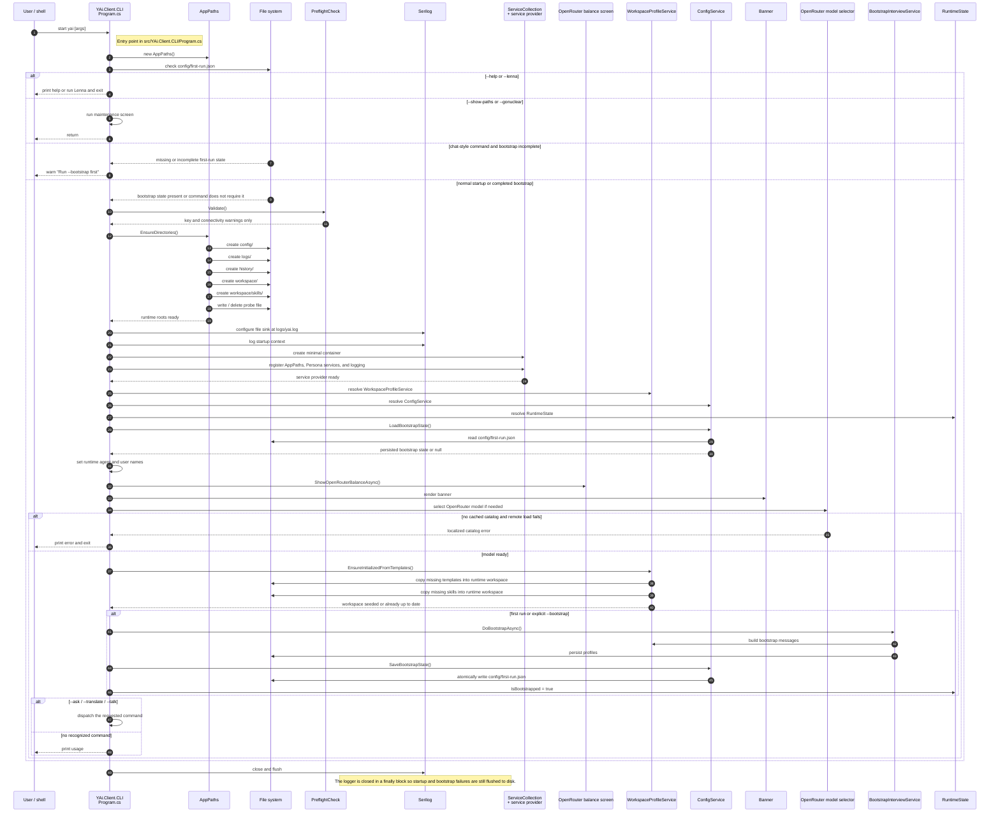

**Document title:** UmbertoGiacobbiDotBiz YAi Client CLI Boot Sequence ✨  
**Prepared by:** Umberto Giacobbi  
**Organization:** UmbertoGiacobbiDotBiz 🚀  
- **Intended use:** Architecture reference for the current YAi.Client.CLI startup and first-run bootstrap lifecycle.  

## Author Profile

Umberto Giacobbi is a founder, consultant, advisor, developer, and operator with international experience across Italy, Switzerland, the United States, Indonesia, and Vietnam. His work spans projects in Europe, the US, and Southeast Asia, with a focus on practical execution, strategic thinking, and technology-led business building.

## Contact Information

- **Email:** [hello@umbertogiacobbi.biz](mailto:hello@umbertogiacobbi.biz)  
- **LinkedIn:** [linkedin.com/in/umbertogiacobbi](https://www.linkedin.com/in/umbertogiacobbi/)  
- **Website:** [umbertogiacobbi.biz](https://umbertogiacobbi.biz)  

## AI Use and Responsibility Notice

This document may include content generated, refined, or reviewed with the assistance of one or more AI models. It should be reviewed and validated before external distribution or operational use. Final responsibility for its verification, interpretation, and application remains with the author(s) and the organization.

# YAi.Client.CLI Boot Sequence

This document describes the boot path implemented in [src/YAi.Client.CLI/Program.cs](../../src/YAi.Client.CLI/Program.cs). It focuses on the CLI process start, the filesystem and logging bootstrap, the dependency injection setup, the workspace seeding step, and the explicit first-run bootstrap command.

The diagram below is intentionally detailed because the startup path touches both process-level concerns and persistent state. The key files and services are:

- [AppPaths](../../src/YAi.Persona/Services/AppPaths.cs) creates and locates the runtime roots, including `config`, `logs`, `history`, and `workspace`.
- [WorkspaceProfileService](../../src/YAi.Persona/Services/WorkspaceProfileService.cs) seeds markdown templates from the packaged asset workspace into the user runtime workspace.
- [ConfigService](../../src/YAi.Persona/Services/ConfigService.cs) reads and writes configuration and the persisted first-run marker.
- [BootstrapState](../../src/YAi.Persona/Models/BootstrapState.cs) is the serialized payload stored on first bootstrap.
- [RuntimeState](../../src/YAi.Persona/Models/RuntimeState.cs) is the in-memory state that marks the current process as bootstrapped.

## Notes on the current implementation

The current CLI is command-driven. It now performs a lightweight bootstrap-state check before the preflight and model-selection work begins. Chat-style commands (`--ask`, `--translate`, and `--talk`) require a completed bootstrap and exit early with a local warning if `config/first-run.json` is missing or incomplete. Maintenance commands such as `--show-paths` and `--gonuclear` also return before the normal bootstrap path.

After that early gate, the process runs the filesystem and logging bootstrap, builds the service provider, loads the persisted bootstrap state again through `ConfigService`, shows the balance and banner, selects an OpenRouter model if one is not already configured, seeds the runtime workspace, and then either dispatches the requested command or runs the explicit `--bootstrap` ritual. The earlier note that `Program.cs` does not call `LoadBootstrapState()` during startup is stale.

## Boot Responsibilities

### Process bootstrap

- `Environment.GetCommandLineArgs()` captures the user intent for the current launch.
- `AppPaths` resolves all roots before any other application service is created.
- Chat-style commands are gated on the persisted `first-run.json` marker before the preflight runs.
- `PreflightCheck.Validate()` emits key and connectivity warnings, but only after the bootstrap gate has passed.
- `EnsureDirectories()` creates the persistent directories and probes write access early so the process fails fast if the user data root is not writable.
- Serilog is configured before any of the application services are resolved so startup failures are captured in `yai.log`.
- The banner prints after the service provider is built and the startup context is logged.

### Runtime service setup

- `ServiceCollection` is used as a minimal container so the CLI can stay lightweight.
- The repository-specific services are registered through `AddYAiPersonaServices()`.
- `WorkspaceProfileService`, `ConfigService`, `RuntimeState`, and the OpenRouter services are resolved from the container and reused for the rest of the launch.
- `ConfigService.LoadBootstrapState()` is called during startup so the bootstrap state can drive the steady-state branch and the explicit bootstrap branch.

### Workspace seeding

- `EnsureInitializedFromTemplates()` copies packaged markdown templates into the runtime workspace.
- Existing files are not overwritten, so repeated launches are safe.
- The workspace seed step is invoked during normal startup before command dispatch and again during the explicit bootstrap command.

### First-run bootstrap

- `DoBootstrapAsync()` writes a `BootstrapState` payload to `config/first-run.json`.
- The payload records the current time and the resolved agent and user names.
- `RuntimeState.IsBootstrapped` is flipped in memory for the current process after the first-run record is saved.
- The explicit `--bootstrap` command and the auto-bootstrap path both use the same persisted marker to decide whether the ritual should run.

## Sequence Diagram

## What the diagram is showing

The diagram separates the startup work into the same branches the current CLI uses:

1. Help and maintenance commands exit before the normal startup path.
2. Chat-style commands that do not have a completed bootstrap stop early with a local warning.
3. Normal startup continues through preflight, logging, DI, model selection, workspace seeding, and then the requested command or explicit bootstrap ritual.

The sequence is deliberately ordered the same way the code executes it:

- bootstrap gating and preflight first,
- filesystem and logging bootstrap second,
- DI container creation third,
- workspace seeding fourth,
- command dispatch last.

That ordering matters because it keeps the application predictable when the user data root is missing, partially initialized, or read-only.

## Source Map

- [src/YAi.Client.CLI/Program.cs](../../src/YAi.Client.CLI/Program.cs)
- [src/YAi.Persona/Services/AppPaths.cs](../../src/YAi.Persona/Services/AppPaths.cs)
- [src/YAi.Client.CLI/Services/PreflightCheck.cs](../../src/YAi.Client.CLI/Services/PreflightCheck.cs)
- [src/YAi.Persona/Services/WorkspaceProfileService.cs](../../src/YAi.Persona/Services/WorkspaceProfileService.cs)
- [src/YAi.Persona/Services/ConfigService.cs](../../src/YAi.Persona/Services/ConfigService.cs)
- [src/YAi.Persona/Services/OpenRouterCatalogService.cs](../../src/YAi.Persona/Services/OpenRouterCatalogService.cs)
- [src/YAi.Client.CLI/Screens/OpenRouterBalanceScreen.cs](../../src/YAi.Client.CLI/Screens/OpenRouterBalanceScreen.cs)
- [src/YAi.Client.CLI/Screens/OpenRouterModelSelectionScreen.cs](../../src/YAi.Client.CLI/Screens/OpenRouterModelSelectionScreen.cs)
- [src/YAi.Persona/Services/OpenRouterBalanceService.cs](../../src/YAi.Persona/Services/OpenRouterBalanceService.cs)
- [src/YAi.Persona/Services/BootstrapInterviewService.cs](../../src/YAi.Persona/Services/BootstrapInterviewService.cs)
- [src/YAi.Persona/Models/BootstrapState.cs](../../src/YAi.Persona/Models/BootstrapState.cs)
- [src/YAi.Persona/Models/RuntimeState.cs](../../src/YAi.Persona/Models/RuntimeState.cs)