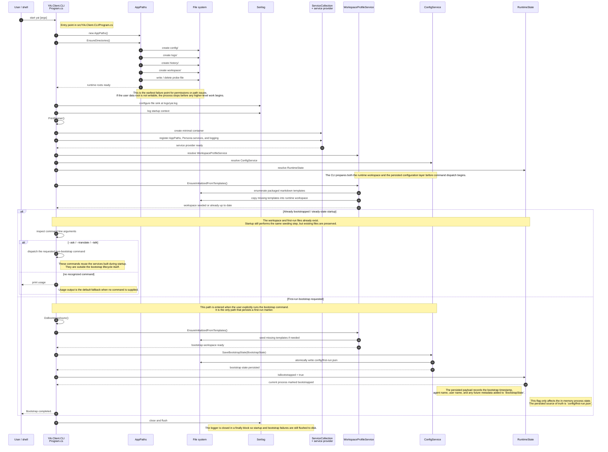

**Document title:** UmbertoGiacobbiDotBiz YAi Client CLI Boot Sequence ✨  
**Prepared by:** Umberto Giacobbi  
**Organization:** UmbertoGiacobbiDotBiz 🚀  
- **Intended use:** Architecture reference for the current YAi.Client.CLI startup and first-run bootstrap lifecycle.  

## Author Profile

Umberto Giacobbi is a founder, consultant, advisor, developer, and operator with international experience across Italy, Switzerland, the United States, Indonesia, and Vietnam. His work spans projects in Europe, the US, and Southeast Asia, with a focus on practical execution, strategic thinking, and technology-led business building.

## Contact Information

- **Email:** [hello@umbertogiacobbi.biz](mailto:hello@umbertogiacobbi.biz)  
- **LinkedIn:** [linkedin.com/in/umbertogiacobbi](https://www.linkedin.com/in/umbertogiacobbi/)  
- **Website:** [umbertogiacobbi.biz](https://umbertogiacobbi.biz)  

## AI Use and Responsibility Notice

This document may include content generated, refined, or reviewed with the assistance of one or more AI models. It should be reviewed and validated before external distribution or operational use. Final responsibility for its verification, interpretation, and application remains with the author(s) and the organization.

# YAi.Client.CLI Boot Sequence

This document describes the boot path implemented in [src/YAi.Client.CLI/Program.cs](../../src/YAi.Client.CLI/Program.cs). It focuses on the CLI process start, the filesystem and logging bootstrap, the dependency injection setup, the workspace seeding step, and the explicit first-run bootstrap command.

The diagram below is intentionally detailed because the startup path touches both process-level concerns and persistent state. The key files and services are:

- [AppPaths](../../src/YAi.Persona/Services/AppPaths.cs) creates and locates the runtime roots, including `config`, `logs`, `history`, and `workspace`.
- [WorkspaceProfileService](../../src/YAi.Persona/Services/WorkspaceProfileService.cs) seeds markdown templates from the packaged asset workspace into the user runtime workspace.
- [ConfigService](../../src/YAi.Persona/Services/ConfigService.cs) reads and writes configuration and the persisted first-run marker.
- [BootstrapState](../../src/YAi.Persona/Models/BootstrapState.cs) is the serialized payload stored on first bootstrap.
- [RuntimeState](../../src/YAi.Persona/Models/RuntimeState.cs) is the in-memory state that marks the current process as bootstrapped.

## Notes on the current implementation

The current CLI is command-driven. It always performs the filesystem bootstrap and template seeding on launch, then dispatches based on the first command-line argument. The persisted `first-run.json` file is written only by the explicit `--bootstrap` command. That means the "already bootstrapped" path in this document represents the steady-state startup path after the workspace and first-run data already exist, not a separate code branch in `Program.cs` that gates startup.

The repository also contains a `LoadBootstrapState()` helper in `ConfigService`, but `Program.cs` does not currently call it during process start. This diagram documents the lifecycle the code is already supporting, while making the steady-state and first-run cases easy to compare.

## Boot Responsibilities

### Process bootstrap

- `Environment.GetCommandLineArgs()` captures the user intent for the current launch.
- `AppPaths` resolves all roots before any other application service is created.
- `EnsureDirectories()` creates the persistent directories and probes write access early so the process fails fast if the user data root is not writable.
- Serilog is configured before any of the application services are resolved so startup failures are captured in `yai.log`.
- The banner prints immediately after logging is initialized so the operator can visually confirm the CLI is alive.

### Runtime service setup

- `ServiceCollection` is used as a minimal container so the CLI can stay lightweight.
- The repository-specific services are registered through `AddYAiPersonaServices()`.
- `WorkspaceProfileService`, `ConfigService`, and `RuntimeState` are resolved from the container and reused for the rest of the launch.

### Workspace seeding

- `EnsureInitializedFromTemplates()` copies packaged markdown templates into the runtime workspace.
- Existing files are not overwritten, so repeated launches are safe.
- The workspace seed step is invoked both during normal startup and during the explicit bootstrap command.

### First-run bootstrap

- `DoBootstrapAsync()` writes a `BootstrapState` payload to `config/first-run.json`.
- The payload records the current time and the resolved agent and user names.
- `RuntimeState.IsBootstrapped` is flipped in memory for the current process after the first-run record is saved.

## Sequence Diagram

## What the diagram is showing

The diagram separates the startup work into two human-level cases:

1. Already bootstrapped or steady state. The runtime workspace already exists, the templates are already seeded, and the process simply completes startup and dispatches the requested command.
2. First-run bootstrap. The operator explicitly invokes `--bootstrap`, causing the CLI to seed the workspace again if needed, persist `first-run.json`, and mark the current process as bootstrapped.

The sequence is deliberately ordered the same way the code executes it:

- filesystem preparation first,
- logging second,
- DI container creation third,
- workspace seeding fourth,
- command dispatch last.

That ordering matters because it keeps the application predictable when the user data root is missing, partially initialized, or read-only.

## Source Map

- [src/YAi.Client.CLI/Program.cs](../../src/YAi.Client.CLI/Program.cs)
- [src/YAi.Persona/Services/AppPaths.cs](../../src/YAi.Persona/Services/AppPaths.cs)
- [src/YAi.Persona/Services/WorkspaceProfileService.cs](../../src/YAi.Persona/Services/WorkspaceProfileService.cs)
- [src/YAi.Persona/Services/ConfigService.cs](../../src/YAi.Persona/Services/ConfigService.cs)
- [src/YAi.Persona/Models/BootstrapState.cs](../../src/YAi.Persona/Models/BootstrapState.cs)
- [src/YAi.Persona/Models/RuntimeState.cs](../../src/YAi.Persona/Models/RuntimeState.cs)