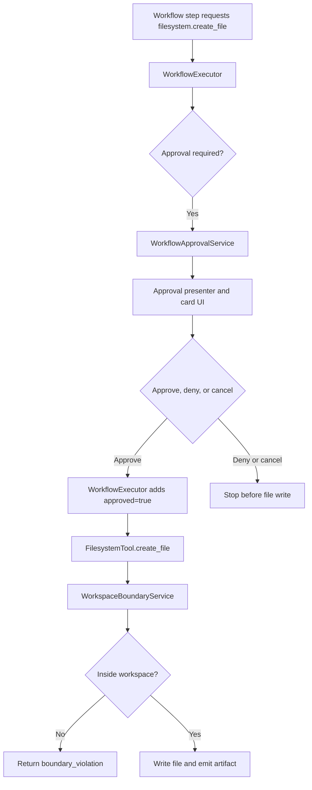

**Document title:** UmbertoGiacobbiDotBiz Filesystem Create-File Approval Flow ✨  
**Prepared by:** Umberto Giacobbi  
**Organization:** UmbertoGiacobbiDotBiz 🚀  
- **Intended use:** A compact view of the current write path for `filesystem.create_file`, showing where approval and workspace-boundary enforcement happen.  

## Author Profile

Umberto Giacobbi is a founder, consultant, advisor, developer, and operator with international experience across Italy, Switzerland, the United States, Indonesia, and Vietnam. His work spans projects in Europe, the US, and Southeast Asia, with a focus on practical execution, strategic thinking, and technology-led business building.

## Contact Information

- **Email:** [hello@umbertogiacobbi.biz](mailto:hello@umbertogiacobbi.biz)  
- **LinkedIn:** [linkedin.com/in/umbertogiacobbi](https://www.linkedin.com/in/umbertogiacobbi/)  
- **Website:** [umbertogiacobbi.biz](https://umbertogiacobbi.biz)  

## AI Use and Responsibility Notice

This document may include content generated, refined, or reviewed with the assistance of one or more AI models. It should be reviewed and validated before external distribution or operational use. Final responsibility for its verification, interpretation, and application remains with the author(s) and the organization.

# Filesystem Create-File Approval Flow

The important point is that the write is blocked both by the workflow approval layer and by the tool's own `approved=true` gate.