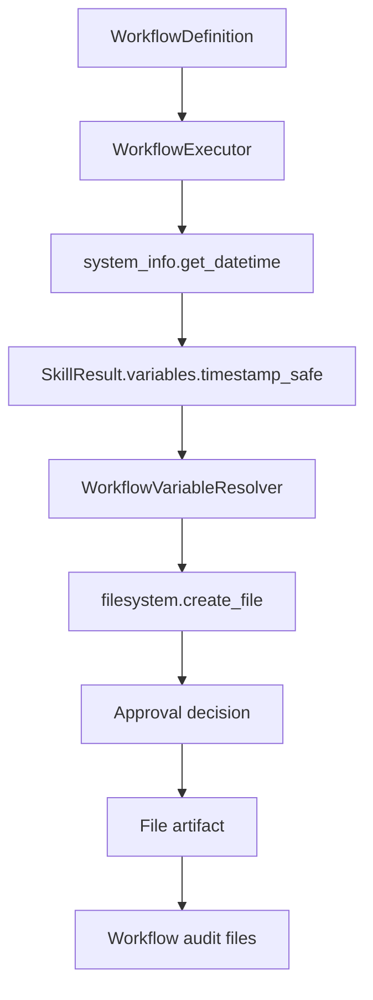

**Document title:** UmbertoGiacobbiDotBiz Linear Workflow Dogfood Flow ✨  
**Prepared by:** Umberto Giacobbi  
**Organization:** UmbertoGiacobbiDotBiz 🚀  
- **Intended use:** A compact diagram showing the current two-step workflow that chains `system_info.get_datetime` into `filesystem.create_file`.  

## Author Profile

Umberto Giacobbi is a founder, consultant, advisor, developer, and operator with international experience across Italy, Switzerland, the United States, Indonesia, and Vietnam. His work spans projects in Europe, the US, and Southeast Asia, with a focus on practical execution, strategic thinking, and technology-led business building.

## Contact Information

- **Email:** [hello@umbertogiacobbi.biz](mailto:hello@umbertogiacobbi.biz)  
- **LinkedIn:** [linkedin.com/in/umbertogiacobbi](https://www.linkedin.com/in/umbertogiacobbi/)  
- **Website:** [umbertogiacobbi.biz](https://umbertogiacobbi.biz)  

## AI Use and Responsibility Notice

This document may include content generated, refined, or reviewed with the assistance of one or more AI models. It should be reviewed and validated before external distribution or operational use. Final responsibility for its verification, interpretation, and application remains with the author(s) and the organization.

# Linear Workflow Dogfood Flow

Current limitation: this workflow is well covered in tests, but it is not yet exposed as a polished turnkey CLI command for ordinary users.