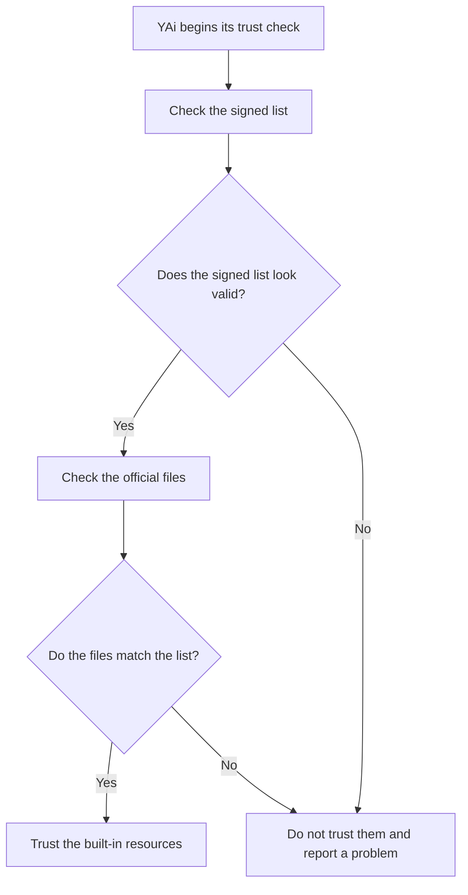

**Document title:** UmbertoGiacobbiDotBiz How YAi! Protects Its Built-In Skills ✨  
**Prepared by:** Umberto Giacobbi  
**Organization:** UmbertoGiacobbiDotBiz 🚀  
- **Intended use:** A plain-English explanation of how YAi! checks that its official built-in skills, templates, and prompt files have not been changed in unsafe or unexpected ways.  

## Author Profile

Umberto Giacobbi is a founder, consultant, advisor, developer, and operator with international experience across Italy, Switzerland, the United States, Indonesia, and Vietnam. His work spans projects in Europe, the US, and Southeast Asia, with a focus on practical execution, strategic thinking, and technology-led business building.

## Contact Information

- **Email:** [hello@umbertogiacobbi.biz](mailto:hello@umbertogiacobbi.biz)  
- **LinkedIn:** [linkedin.com/in/umbertogiacobbi](https://www.linkedin.com/in/umbertogiacobbi/)  
- **Website:** [umbertogiacobbi.biz](https://umbertogiacobbi.biz)  

## AI Use and Responsibility Notice

This document may include content generated, refined, or reviewed with the assistance of one or more AI models. It should be reviewed and validated before external distribution or operational use. Final responsibility for its verification, interpretation, and application remains with the author(s) and the organization.

# How YAi! Checks Its Built-In Skills Before Trusting Them

## 1. The Big Idea

YAi! is designed to be careful.

Before it trusts its own built-in skills, templates, and prompt files, it checks that they are the real ones and that they have not been quietly changed.

You can think of it like this: if a child brings home a lunchbox with a safety seal, you feel better when the seal is still intact. It does not mean the world is perfectly safe. It means one important check has already been done.

That is what this system is for. It is one line of defence. Not the only line of defence, but an important one.

## 2. What YAi! Is Checking

YAi! has some files that it treats as part of its official starting kit. These include built-in skills, templates, and prompt assets.

These files matter because they help shape how YAi! behaves. If someone changed them without permission, the system could act differently from what the project intended.

So YAi! does not simply say, "The files are here, so they must be fine." It checks them first.

## 3. A Child-Sized Explanation

Imagine you have a toy box with a list on the lid that says what should be inside.

The list says:

- which toys belong in the box,
- how many there should be,
- and what they should look like.

Now imagine the box also has a special stamp that shows the list came from a trusted grown-up.

Before YAi! opens the box and uses what is inside, it does two simple things:

1. It checks that the list really came from the trusted source.
2. It checks that the things in the box still match the list.

If both checks pass, YAi! can say, "Good. This looks like the right box with the right things inside."

If the checks do not pass, YAi! does not pretend everything is okay. It stops trusting those files and tells you there is a problem.

## 4. What The Files Do

Behind the scenes, YAi! uses three small helper files for this check:

- a public key,
- a manifest,
- and a digital signature.

You do not need to know the technical details to understand the job.

Together, these files help YAi! answer a simple question:

"Are these really the official files we expected, or has something changed?"

### Verification Flow

## 5. Why This Matters

This matters because trust should not be based on hope.

It is easy for software projects to say they are safe. It is more useful when they can show one of the checks they actually perform.

This mechanism helps YAi! notice if an official skill or tool file has been changed, replaced, damaged, or gone missing. That makes silent surprises less likely.

Again, this is one line of defence. It is not the whole safety story. YAi! also needs careful boundaries, approvals, audits, and clear reporting. But this check is an important first gate.

## 6. What Happens When Everything Is Fine

When the files match what YAi! expects, the experience is simple.

YAi! verifies them and moves on.

There is no drama, no noise, and no extra burden for the user. The system just confirms that its official starting pieces still look genuine.

## 7. What Happens When Something Is Wrong

If something does not match, YAi! does not quietly look the other way.

It does not say, "Close enough."

It does not pretend nothing happened.

Instead, it treats the mismatch as a warning sign. That could mean a file was changed on purpose, changed by mistake, or altered in a way nobody expected.

In those cases, YAi! reports the problem instead of trusting the files blindly.

## 8. Why This Helps Non-Technical People Too

You do not need to be a developer to care about this.

If a system says, "Trust me," a sensible person should be able to ask, "Why?"

This document describes one practical answer. YAi! checks that the official built-in pieces still match the approved version before it treats them as trusted.

That does not make the system magical. It makes the system more honest.

## 9. Looking Ahead

Today, this protection is focused on YAi!'s official built-in resources.

In the future, the same idea can help certify third-party skills or tools too. That means even resources that are not directly under YAi!'s control can still be checked for tampering before they are trusted.

That future direction follows the same principle: do not trust first and inspect later. Check first.

## 10. The Shortest Summary

YAi! checks its built-in skills before trusting them.

It does this so changed or suspicious files are easier to catch.

It is one line of defence in a bigger trust model.

If you want the broader trust philosophy behind this, see [MANIFEST.md](../../MANIFEST.md).
